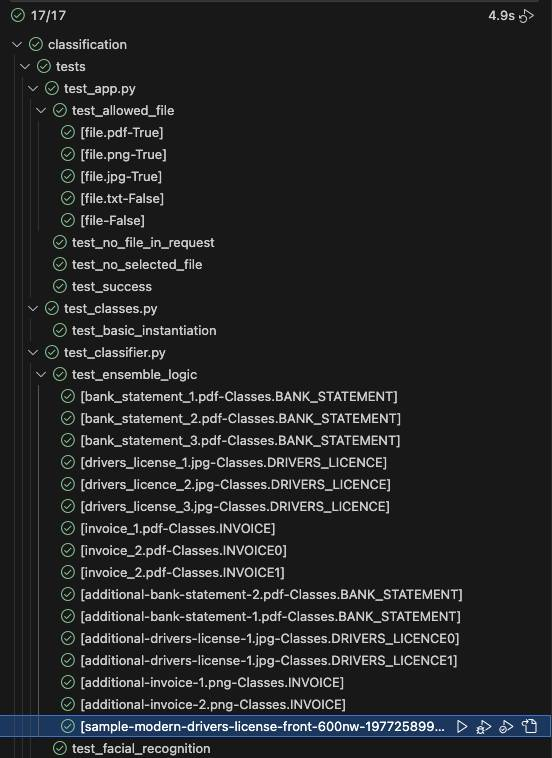

# Solemn oath
In the spirit of the challenge, I hereby swear that I will not use ChatGPT, Claude, or any other LLM to write any code in this fork.
(Although of course, I am no stranger to them)

# Reader's note
- I have marked with TODOs the 'next steps' that I identified throughout development, that were out of scope for the short timeframe.

# Marking Criteria Comments
- **Functionality**: Does the classifier work as expected?
    - All local files are classified correctly.
    - I have also added a few randomly selected examples from the internet to guard against overfitting, which are also being classified correctly.
    - TODO: assess on external files.
- **Scalability**: Can the classifier scale to new industries and higher volumes?
    - The containerisation means that, with an appropriate load balancer/API in front of the app, it could scale horizontally very easily
    - The selection of lightweight packages, and the minimisation of the container image both make the scaling process more lightweight
    - The ensemble methodology was designed with scalability to new use-cases in mind
    - Adding new document types is as simple as adding some keywords, and potentially integrating them into the facial recognition logic
- **Maintainability**: Is the codebase well-structured and easy to maintain?
    - Class interface and ensemble methodology support extensibility, can you think of a new classification approach? Add it!
    - I believe the structure of the constants file also lends itself to easy maintenance, including the filetype definition
    - Pre-commit ensure the code is resistant to degrading style/formatting
- **Creativity**: Are there any innovative or creative solutions to the problem?
    - You decide!
- **Deployment**: Is the classifier ready for deployment in a production environment?
    - Container is partially minimised, there would be an additional step to more the tesseract lib installation into the build phase
    - prod and dev pixi environments segregate dependencies
- **Testing**: Are there tests to validate the service's functionality?
    - As ever, more tests would probably be better.
    - I have hooked up the existing tests to the new logic, and they are passing:
    

# Approach - Classifier
I have taken an ensemble approach, rather than placing all the eggs in a single basket, I let a few different targeted approaches 'vote' on the result. As long is the math is right, this can allows targeted algorithms (that are strong on a certain doc type) have higher influence when they are very confident.
- The EnsembleClassifier can be instantiated with any number of IndividualClassifiers
- Each IndividualClassifier adheres to the interface, and provides predictions with it's own methodology, e.g. face recognition.
- The probability is supplemented with a confidence in some cases
- The individual votes are collated by the EnsembleClassifier to find the strongest positive class score. TODO: implement negative class scoring
- An idea I would love to try (but ran out of time) would be to use Word2Vec embedding to assess the similarity of scraped words to the keywords

### Insights
- Don't put overdue emphasis on the filename, since it highly unreliabile in general. We can use it, but we should limit the confidence of results derived from it.

# Local development
### Non-pixi deps
The OCR library uses Google's tesseract model, which requires a java installation before use. https://tesseract-ocr.github.io/tessdoc/Installation.html

MacOs installation via brew:
```
brew install tesseract
```

Linux installation::
```
sudo apt install tesseract-ocr
sudo apt install libtesseract-dev
```
### pixi deps
```
curl -fsSL https://pixi.sh/install.sh | bash
pixi shell
```

### Activate precommit hook
```
pre-commit install
```

# Running the container locally
The addition of the facial recognition library has caused an issue with the container when running locally on Apple Silicon, there is an incompatibility with the underlying tesseract library and the emulated linux/amd64 architecture.

This means that, when running the container locally on Apple Silicon, you will see these errors:
```
[2024-11-21 21:55:55 +0000] [1] [ERROR] Worker (pid:339) was sent SIGILL!
[2024-11-21 21:55:55 +0000] [362] [INFO] Booting worker with pid: 362
[2024-11-21 21:55:55 +0000] [1] [ERROR] Worker (pid:338) was sent SIGILL!
[2024-11-21 21:55:55 +0000] [370] [INFO] Booting worker with pid: 370
[2024-11-21 21:55:55 +0000] [1] [ERROR] Worker (pid:354) was sent SIGILL!
[2024-11-21 21:55:55 +0000] [385] [INFO] Booting worker with pid: 385
[2024-11-21 21:55:55 +0000] [1] [ERROR] Worker (pid:362) was sent SIGILL!
```

And, unfortunately, I am out of time. I expect this issue will not be present when running in a remote linux environment.

These were the working build/run commands until the addition of facial_recognition caused the above issue.
```
docker build . -t classifier --platform linux/amd64
docker run --rm -it --platform linux/amd64 classifier:latest
``` -->
